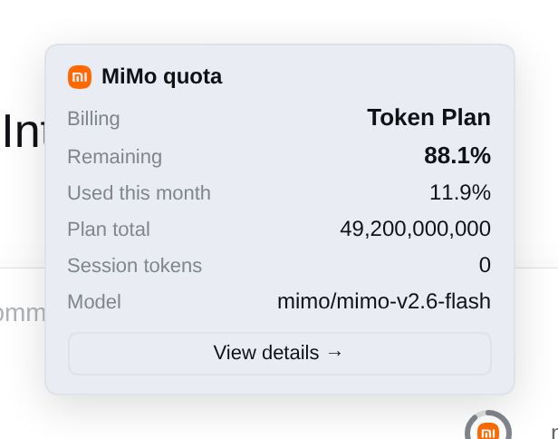
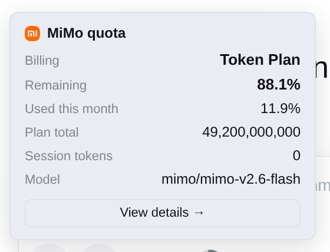

# dsh-mimo-usage

DeepSeek Harness 插件：**MiMo 额度胶囊**（位置可配置）+ **MiMo 用量详情页**（当前模型计费类型、使用量、收费、用量统计、用量预测、**内置 Cookie 配置**）。

> **阅读约定**：文中的具体路径（`/vol1/...`）、地址（`127.0.0.1:3081`、`<NAS>:3080`）
> 来自 fnOS NAS 部署环境，替换成你自己的即可。Cookie 相关内容只出现**字段名**
> （`api-platform_serviceToken` / `userId`），不含任何真实凭据；插件也**从不把
> Cookie 回传给浏览器**，只存在本机 `settings.yaml`。

## 功能

| 入口 | 显示内容 | 说明 |
| --- | --- | --- |
| 额度环 | **mi logo + 用量环** | 环内嵌小米 logo，环画**套餐剩余百分比**；**按量计费没有总量 → 只画空环**（不画误导性的 0%/100%）。位置可配置（见下） |
| 点击额度环 | 用量摘要卡 | 计费类型、剩余额度/会话 tokens、本月已用、套餐总量、请求次数、当前模型，底部有「查看详情」入口 |
| 详情页 | MiMo 用量 tab | 当前模型、计费类型、**本会话 MiMo 用量（按渠道归属）**、今日/历史用量、收费估算、用量趋势与预测，**页面底部可配置 Cookie 等** |

| 额度环 | 点击弹出用量摘要卡 | 移动端（390px） |
| --- | --- | --- |
|  |  |  |

### 会话余额按渠道归属（重要）

**一个会话可以换过模型**，所以 `session.totalTokens` 不等于「MiMo 用量」。实测某会话：

```
mimo/mimo-v2.6-flash          49,771,661 tokens / 367 calls
codebuddy/deepseek-v4.1-flash 89,081,411 tokens / 414 calls
─────────────────────────────────────────────────────────
总计                         138,853,072 tokens（其中 64% 不是 MiMo）
```

插件按 `models[].provider`（`/mimo/i` 匹配，与额度环可见性同规则）
**只统计 MiMo 归属部分**，三种情形都有明确交代：

| 情形 | 显示 |
| --- | --- |
| 会话混用了多个渠道 | 汇总只算 MiMo；下方列出各非 MiMo 渠道并声明「不计入上方汇总」；**费用标注「估算」**（分渠道明细只有总量、无输入/输出拆分，按 token 占比折算） |
| **本会话完全没用 MiMo** | 明确提示「本会话尚未使用 MiMo，会话用量为 0 是正常的」，并说明下方**套餐额度是账号级的**、与会话无关 |
| 无分渠道明细（老计数器 / 统计降级） | 标注「未细分渠道」，退回整体计数 —— **不猜测，也不把数据抹成 0** |

明细表给非 MiMo 行加「不计入 MiMo」标记并弱化，另加 `%` 列显示各渠道占比。

> 顺带修掉一个**费用高估 bug**：早期版本用整会话的 input/output 乘 MiMo 单价，
> 会话换过模型时会把别的渠道的消耗也算成 MiMo 花费。

### 只在用 MiMo 模型时显示

额度环绑定的是 **MiMo 通道**，因此**只在当前模型属于 MiMo 时渲染**（与
`dsh-codebuddy` 的 `codebuddyUsageVisible` 同一机制：读会话投影 `modelSelection`
的 `next`/`lastUsed.provider`，用 `/mimo/i` 宽松匹配）。

用别的 provider（如 codebuddy）时整个环不渲染 —— 否则会出现"明明没用 MiMo
却在报 MiMo 额度"的误导。详情页此时会在模型卡下标注「当前模型属于 X，不是 MiMo，
下面的套餐额度是 MiMo 账号级的」。

> **读不到 provider 时保持显示**（宁可多显示，也不因读取失败而静默关掉功能）。
> 投影不可用时用 `/summary` 的 `provider` 兜底。

### 尺寸与外观

对齐 `dsh-codebuddy` 的用量环，**两者并排时大小一致**（改前请先核对 codebuddy
是否也变了）：

| 项 | 值 | 对应 codebuddy |
| --- | --- | --- |
| 环直径 | `26` | `Progress type="circle" width={26}` |
| 环宽 | `3` | `strokeWidth={3}` |
| 中心 logo | `12` | `CodeBuddyLogo size={12}` |
| 环底圈 | `--dsw-alias-border-l3` | `orbitStroke` |
| 环进度 | `--dsw-alias-label-tertiary` | `stroke` |
| logo 底色 | `--dsw-alias-brand-primary` | `variant="mono"` 的 `tileFill` |
| 起点 | `rotate(-90)` 12 点方向顺时针 | Semi 默认 |

尺寸**不随窄屏/紧凑模式缩小** —— 紧凑场景靠去掉内边距解决，避免与 codebuddy 不齐。
配色用平台主题变量（`dsh-web-frontend` 定义），因此自动跟随主题。

> 实现说明：codebuddy 用 `@douyinfe/semi-ui` 的 `Progress`，而 semi **不在平台
> seed 表**里（它自己打进了 6.5MB bundle）。本插件**手写等价 SVG 双圈**，零依赖。
> mi logo 用 [simple-icons 的 xiaomi 路径](https://github.com/simple-icons/simple-icons/blob/develop/icons/xiaomi.svg)。

### 胶囊位置（可配置）

在「MiMo 用量」页底部的配置表单里选择，保存即生效（无需重启）：

| 取值 | 位置 | 说明 |
| --- | --- | --- |
| `header` | 标题行 | 与「对话 / 轨迹」标签同一行的右侧动作区 |
| `toolbar`（默认） | 输入框工具栏 | 模型选择器旁，即 codebuddy 用量环的位置 |
| `above` | 输入框上方 | 独占一行，最不挤占其它工具 |
| `hidden` | 不显示 | 只保留详情页 |

**用量摘要卡（点击环弹出）的位置**：无论胶囊在哪个座位，弹层都用
**`createPortal` 挂到 `document.body`**，再按锚点位置与视口空间自动摆位 ——
水平越界就左移、贴顶就翻到下方、`resize`/滚动时重算、内容过高时内部滚动。

> 这样彻底避免了"弹窗跑到屏幕外 / 被父容器 `overflow` 裁掉"：
> 祖先的裁剪上下文不再影响它，且任何视口尺寸（含 320px 极窄、
> 800×360 横屏）下都完整可见。平台自己的 `Tooltip` 原语也是这个做法。

### 工具栏自动换行（可配置）

插件多了以后，输入区工具图标会互相挤压重叠。配置表单里的「**允许输入框工具栏
自动换行**」（默认开启）注入的样式只作用于**组内**（`_tools` / `_actions` /
左右槽位容器），让图标在本组内折行；它**不改整行**。整行是否换行由产品原生
样式决定，装了 `dsh-web-mobile-cyanmod` 时则被它覆盖成 `nowrap` —— 即「整行单行
对齐 + 组内折叠」，两者可以叠加。关闭后立即恢复官方默认行为。

### 移动端竖屏适配

窄屏（<640px，竖屏手机）自动切换布局：

- 详情页所有卡片区从多列改为**单列堆叠**，内边距与字号同步收窄
- 按模型表格外层可**横向滚动**，不撑破卡片
- 用量柱状图降低柱高（60px → 46px）并允许横滚
- 胶囊在窄屏自动隐藏「mimo额度」文字，只留百分比/用量数值，避免挤压会话标题

宽屏（≥640px）保持多列自适应布局。横竖屏切换、窗口拖动都会实时重排。

## Cookie 配置入口（在「MiMo 用量」页内）

打开 **MiMo 用量** 标签页，拉到底部即可看到 **MiMo 额度配置**：

| 字段 | 作用 |
| --- | --- |
| MiMo 控制台 Cookie | 官方接口鉴权；留空 = 保持不变，勾选「清除已保存的 Cookie」可清掉 |
| 本地兜底套餐总量 | 未配 Cookie 时用于估算剩余的月度总量（tokens） |
| 额度胶囊位置 | 见上表 |
| 允许输入框工具栏自动换行 | 见上节 |

**保存的值写入 `$DSH_HOME/settings.yaml` 的 `dsh-mimo-usage` 命名空间**，优先级高于 `cordis.patch.yml` 里的 `config`（config 仅作组成基线）。

> 🔒 **安全**：Cookie 只存在本机 `settings.yaml`，**不回传给浏览器** ——
> 读取接口只返回「是否已配置 + 来源」，输入框也永不回显明文。

### 这个 Cookie 是给「套餐」用的（不是按量专用）

同一个控制台 Cookie 打**三个**接口，**Token Plan 的数据恰恰依赖它**：

| 接口 | 读什么 | 归属 |
| --- | --- | --- |
| `tokenPlan/detail` | 套餐码、周期、是否过期 | **Token Plan** |
| `tokenPlan/usage` | 已用百分比、各 `items` | **Token Plan** |
| `balance` | 现金 / 赠金余额 | 按量 |

即：**套餐用户不填 Cookie → 剩余百分比读不到**（两个 `tokenPlan/*` 都会 401），
只能退回本地估算；按量用户填了也只能读到 `balance`（按量本来就没有 `tokenPlan/usage`）。

实测（2026-09-27，有效 Cookie）：

```sh
curl -H "cookie: <你的 Cookie>" https://platform.xiaomimimo.com/api/v1/tokenPlan/detail
# → {"code":0,"data":{"planCode":"lite:year","currentPeriodEnd":"2027-09-04 23:59:59",...}}
curl -H "cookie: <你的 Cookie>" https://platform.xiaomimimo.com/api/v1/tokenPlan/usage
# → {"code":0,"data":{"monthUsage":{"percent":0.1186,"items":[{"name":"month_total_token",...}]}}}
```

### 粘贴

Cookie 是几百字符的长串，输入框**支持**：

- **Ctrl+V / 右键粘贴** —— 输入框是 `type="text"`（不是 `password`），
  粘贴不受浏览器对密码字段的额外限制，且内容可见便于核对
- **「粘贴」按钮** —— 走 `navigator.clipboard.readText()`，Ctrl+V 失效时兜底
  （无权限/非安全上下文会提示手动粘贴）
- 显式 `onPaste` 处理：受控 input 在部分宿主下不派发 `onChange`，会表现为"粘不上"

获取 Cookie 的步骤（表单内也有提示）：

1. 登录 <https://platform.xiaomimimo.com>（余额页或控制台任意页均可）
2. DevTools → Network → 任一 `/api/v1` 请求 → Headers → 复制完整 `Cookie` 请求头
3. 确认包含 `api-platform_serviceToken` 与 `userId`，整段粘贴进表单并保存

也可以不用界面：把 Cookie 写进 `$DSH_HOME/.credentials.yaml` 的 `refs.MIMO_CONSOLE_COOKIE`，
或直接编辑 `cordis.patch.yml` 的 `mimo.cookie`。

## 接口路径与 fnOS 网关前缀（重要）

插件宿主路由是 **`/dsh-mimo-usage/*`**，刻意**不用** `/api/*`。

### 为什么不用 `/api`

DSH 核心对 `/api` 前缀有一条严格的 Host/Origin fence
（`dsh-client-connection` 的 `isTrustedApiRequest`）：

1. `Host` 必须是 loopback（`localhost` / `127.x`），或是启动参数 `--trusted-host` 列出的 authority
2. **且 `Origin.host` 必须完全等于 `Host`**

经 fnOS 网关（`https://<NAS>:3080`）访问时 `Host` 被改写成 `127.0.0.1:3081`、
而浏览器发的 `Origin` 是 `https://<NAS>:3080` → 第 2 条永不成立 → 一律 **403**。

非 `/api` 前缀没有这层 fence。

### 必须补 `__FNOS_GATEWAY_PREFIX__`（否则 405 / 404）

fnOS 网关（`/vol1/@appcenter/dsh-fnos/gateway.js`）把整个页面挂在
**`/app/dsh-fnos/dsh/`** 下，并做三件事（`handleGuide` → `proxyGuideDsh`）：

1. 转发前**剥掉**前缀：`/app/dsh-fnos/dsh/x` → `/x`
2. 改写 HTML：`<base href="/">` → `<base href="/app/dsh-fnos/dsh/">`
3. 在 `<head>` 注入 `<script>globalThis.__FNOS_GATEWAY_PREFIX__="/app/dsh-fnos/dsh"</script>`

**关键坑：`<base href>` 对以 `/` 开头的绝对路径无效。** 所以插件直接
`fetch("/dsh-mimo-usage/summary")` 会打到 `https://<NAS>:3080/dsh-mimo-usage/summary`
—— 没有前缀，网关走无前缀分支原样转发，落到 core 的未注册路径上：

- **POST** → `@deepseek-ai/dsh-host-frontend-static` 的 fallback seat
  返回 **405 且空 body**（`if (req.method !== "GET" && req.method !== "HEAD")`）
- **GET** → 404

平台对**官方客户端模块**是用 `patch-dsh.mjs` 逐个打补丁的
（`dsh-client-connection` / `dsh-api-gateway` / `dsh-client-hmr` /
`dsh-client-file-upload` / `dsh-client-ui-deliverables` / `dsh-session-log-export`），
**第三方插件不在名单里，必须自己处理。**

本插件的做法（`client.js` 的 `gatewayPath()`）：

```js
function gatewayPath(path) {
  let prefix = "";
  try {
    if (typeof globalThis !== "undefined" && typeof globalThis.__FNOS_GATEWAY_PREFIX__ === "string") {
      prefix = globalThis.__FNOS_GATEWAY_PREFIX__;
    }
  } catch { /* 忽略 */ }
  return prefix.replace(/\/+$/, "") + path;   // 去尾斜杠，避免 //
}
```

**每次发送时求值**（不是模块加载时）：前缀由 HTML 内联脚本注入，
而本脚本同为启动清单成员，执行顺序不保证。

| 环境 | `__FNOS_GATEWAY_PREFIX__` | 实际请求路径 |
| --- | --- | --- |
| 直连 `http://127.0.0.1:3081` | `undefined` | `/dsh-mimo-usage/summary` |
| 经网关 `https://<NAS>:3080` | `/app/dsh-fnos/dsh` | `/app/dsh-fnos/dsh/dsh-mimo-usage/summary` |

写插件的通用建议：**任何插件自己的 HTTP 路由都要套一层 `gatewayPath()`**，
否则只在直连时能用、经网关必挂。诊断通道尤其要注意 ——
它正是用来排查"装了没生效"的，自己先被网关挡掉就白搭。

### 端点一览

| 端点 | 方法 | 用途 |
| --- | --- | --- |
| `/dsh-mimo-usage/summary` | GET | 额度与用量汇总（`?refresh=1` 绕过缓存） |
| `/dsh-mimo-usage/session` | GET | 指定会话的 token 用量（`?id=<sessionId>`） |
| `/dsh-mimo-usage/settings` | GET / POST | 读取 / 保存配置（Cookie 等） |
| `/dsh-mimo-usage/ping` | POST | 浏览器半自诊断回传（随 `/summary` 的 `client` 字段吐出） |

## 单位说明：Token Plan 用 Credits

小米 Token Plan 的额度单位是 **Credits**，不是 tokens、也不是人民币；
按量付费才是人民币余额。两者**互不通用**：

- 订阅套餐时，`/api/v1/balance` 恒为 0 —— 这是正常的，详情页会标注说明
- 官方换算（每百万 token 消耗的 Credits）：

  | 模型 | 缓存命中 | 缓存未命中 | 输出 |
  | --- | --- | --- | --- |
  | mimo-v2.6-pro | 2.5 | 300 | 600 |
  | **mimo-v2.6-flash** | 2 | 100 | 200 |
  | mimo-v2.5-pro | 2.5 | 300 | 600 |
  | mimo-v2.5 | 2 | 100 | 200 |

- **闲时 0.8 倍**：北京时间 00:00–08:00 只扣 80%
- 用量达 50% / 90% / 100% 时官方会短信+邮件提醒

### ⚠️ 官方 `percent` 是比值（0~1），不是百分数

`tokenPlan/usage` 返回的 `percent` 是 **0~1 的比值**，必须 ×100 才是百分比
（实测：`used/limit = 4725102737/49200000000 = 0.096038`，接口回 `percent: 0.0960`）。
控制台前端的换算是 `Math.min(100, Math.max(0, 100 * e))`，
所以 `0.0960` 在官网显示为 **9.6%**。本插件 `toPercent()` 采用同一口径；
早期版本直接把它当百分数显示，「本月已用」只有真实值的 **1/100**
（0.096 被显示成 0.10%）。回归用例见 `check.mjs` 第 6 节。

## 数据来源（官方接口优先，本地统计兜底）

1. **官方接口优先**（需 Cookie）：
   - `GET https://platform.xiaomimimo.com/api/v1/balance` — 余额/现金/赠金
   - `GET https://platform.xiaomimimo.com/api/v1/tokenPlan/detail` — planCode、currentPeriodEnd、expired
   - `GET https://platform.xiaomimimo.com/api/v1/tokenPlan/usage` — monthUsage{percent, items[{name, used, limit, percent}]}（percent 需 ×100）
   - 鉴权：请求头携带 `Cookie`（需含 `api-platform_serviceToken` 与 `userId`）

2. **本地估算兜底**（Cookie 未配置或接口失败）：
   - 聚合 `$DSH_HOME/token-usage/usage-*.jsonl` 的本月用量
   - 除以 `mimo.planTotalTokens`（默认 5 亿/月）得剩余百分比
   - 详情页顶部标注"本地估算（官方接口不可用）"

3. **内置会话统计**（`token-usage/` 目录缺失时的兜底）：
   - `token-usage/` 与 `ctx.tokenUsageCounter` 都由 `dsh-token-usage-counter` 提供；
     **该插件未装进 profile 时目录根本不存在**。旧行为是把
     `ENOENT: no such file or directory, scandir '.../token-usage'` 当错误抛出来，
     且「今日/本月 tokens」「当前会话用量」永远是 0。
   - 现在目录缺失按「暂无记录」处理（`local.ok=true, local.missing=true, local.note` 说明原因），
     并由 `createLocalUsageCounter()` 直接读会话事件（`assistant/message.data.usage`）
     自建统计填上数值，来源标注 `local.source = "session-events"`。
   - 口径：**进程启动以来、仍存活的会话**，重启归零；它只读不落盘，
     一旦 `dsh-token-usage-counter` 装回来并有数据，仍以它的落盘数据为准。
   - 去重靠事件 `seq`：`/session` 每 60s 重复扫描不会把用量翻倍。

## 计费类型判定（自动推断，可覆盖）

判定顺序（`billingTypeFor()`，回归用例见 `check.mjs`）：

1. `mimo.billingTypeOverrides`（`provider/model` 或 `provider`）→ **用户说了算**
2. **provider 的 API 地址 `baseURL`**（`billingTypeFromBaseURL()`，从 `llm-pi-ai` 命名空间读）
   —— 小米两条通道的地址根本不同（pi-ai 官方目录 `providers/*.json` 实测）：

   | 计费方式 | 目录里的 provider | baseURL |
   |---|---|---|
   | 按量付费 | `xiaomi` | `https://api.xiaomimimo.com/v1` |
   | Token Plan | `xiaomi-token-plan-cn` | `https://token-plan-cn.xiaomimimo.com/v1` |
   | Token Plan | `xiaomi-token-plan-sgp` | `https://token-plan-sgp.xiaomimimo.com/v1` |
   | Token Plan | `xiaomi-token-plan-ams` | `https://token-plan-ams.xiaomimimo.com/v1` |

   地址里含 `token-plan` → **套餐**；是 `xiaomimimo.com` 其余子域 → **按量**；读不到（自建网关/命名空间缺失）→ 继续往下走。
3. provider 名含 `token-plan`（如 `xiaomi-token-plan-cn`）→ **Token Plan 套餐**
4. provider `mimo`（小米通道）但地址没读到 → 用官方 `tokenPlan/detail` 反证
   （`summary.planStatus` 四态）：`expired`（套餐已过期）/ `none`（官方明确「无订阅」）→ 按量；
   `active` / `unknown`（没配 Cookie、接口失败）→ 套餐
5. 其余 provider → **按量计费（pay-as-you-go）**

> 本机这条路由叫 `mimo`、地址是 `token-plan-cn.xiaomimimo.com`，所以判 **Token Plan 套餐**。
> 早期版本只认 provider 名里的 `token-plan` 字面量，于是恒判成**按量**，
> 胶囊因此显示「会话 tokens」而不是套餐剩余百分比。

### 「当前模型」从哪读（影响计费判定的输入）

判定用的 `provider`/`model` **不是**「最近一次请求用过的」，而是
**「当前选中的」** —— 顺序如下（`createModelTracker`）：

| 优先级 | 来源 | 语义 |
|---|---|---|
| ① | **`agent-default-model` 命名空间** | **用户此刻选的是什么**（切模型立即写入，与 UI 同源） |
| ② | `session/event` 的 `request/header` | 最近一次**真的发过请求**用的是什么 |
| ③ | 落盘计数器快照 | 历史 |
| ④ | 内置统计快照 | 历史 |
| ⑤ | 空 | 计费退化为 provider 命名约定 |

> ⚠ **① 必须在 ② 之前。** 早期只有 ②~④，于是：在 UI 里把模型切到 MiMo
> **但还没发消息**时，仍按旧模型判定 → 显示"按量付费"，而模型选择器已经是 MiMo。
> 这个顺序是**有语义的**（`agent-default-model` 必须优先于事件流）。

单价：按量模型用 `mimo.pricing.<provider/model>`（元/百万 tokens），未配置用 `fallbackPrice`。Token Plan 套餐内调用**不额外收费**。

> 想强制某条路由按量（或反过来）：写 `billingTypeOverrides: { mimo: payg }` 即可。

## 安装

标准方式（仓库发布到 GitHub / npm 后）：

```sh
dsh plugin --profile web add <你的仓库或包名>
```

下文其余部分是**本工作区的 fnOS NAS 部署实录**（含路径与环境前置），
替换为你自己的环境即可，插件本身的行为不依赖这些路径。

> **两个环境前置条件**（都与插件本身无关）：
>
> 1. **必须显式设置 `DSH_HOME`** —— `dsh` 未设该变量时回退到 `~/.dsh`，
>    从 fnOS 的 root 登录 shell 直接跑会把插件装进 `/root/.dsh/profiles/web`
>    而非应用真正使用的 `$DSH_HOME/profiles/web`，表现为"安装成功但界面无变化"。
> 2. **可能需要 `--config.minimumReleaseAge=0`** —— pnpm 11 默认启用 24 小时
>    "最小发布年龄"供应链检查；若 lockfile 里有刚发布的包（如 `dshmarket@1.58.0`），
>    install 会在校验阶段被拦下，而这个参数可临时放宽该策略。

```sh
export DSH_HOME=/vol1/@apphome/fn-deepseek-harness
export HOME=/vol1/@appshare/fn-deepseek-harness   # 与 fnOS 应用一致，共用同一个 pnpm store
cd /vol1/1000/deepseek_harness/fnos

# 从本地目录安装
dsh plugin --profile web add ./dsh-mimo-usage --config.minimumReleaseAge=0

# 或从 tgz（跨机器分发推荐）
dsh plugin --profile web add ./dsh-mimo-usage-0.2.0.tgz --config.minimumReleaseAge=0
```

安装后**重启 `dsh web`**，再刷新浏览器（F5）使新 boot graph 生效。

**验证真的落盘**（第一条无输出即为装错位置）：

```sh
P="$DSH_HOME/profiles/web"
grep '"dsh-mimo-usage"' "$P/package.json"
ls -la "$P/node_modules/dsh-mimo-usage"
dsh --profile web --dump-config | grep -A3 "mimo-usage"   # 应打印 id: mimo-usage
```

> profile 目录对受限用户只读时需用有写权限的账号执行。

## 配置

编辑 `$DSH_HOME/profiles/web/cordis.patch.yml`，在 `mimo-usage` 条目下：

```yaml
- insert:
    - id: mimo-usage
      name: dsh-mimo-usage
      config:
        mimo:
          cookie: "api-platform_serviceToken=xxx; userId=yyy; ..."   # 官方接口 Cookie
          planTotalTokens: 500000000                                  # 本地兜底套餐总量
          billingTypeOverrides:
            xiaomi-token-plan-cn: token-plan
            deepseek-official/deepseek-chat: payg
          pricing:
            fallbackPrice: { input: 0, output: 0, cacheRead: 0, cacheWrite: 0 }
            "deepseek-official/deepseek-chat": { input: 2, output: 8, cacheRead: 0.5, cacheWrite: 0 }
```

## 结构

- `host.js` — 宿主插件：注册 `/api/dsh-mimo-usage/*` 路由（balance / tokenPlan / usage / summary），Cookie 调官方接口，失败回退本地 usage 日志聚合；顺带注册 `/mimo` 斜杠命令与 `mimo_usage` 工具供模型查询。
- `client.js` — 浏览器 bundle（`__ModuleLoader__` 工厂格式，仅依赖平台共享 react，无构建步骤）：
  - `conversation.session.header.actions` 槽位（order 30，位于 jobs/trajectory 标签之后）→ **mimo额度** 胶囊
  - `conversation.view` 槽位（id `mimo-usage`，label "MiMo 用量"）→ 详情页 tab
- `package.json` — 声明 `dsh.bundle`（空 patch）+ `dsh.client`（web 平台）
- `cordis.patch.yml` — 自激活层（含默认配置与 Cookie 配置说明）

## 更新频率

- 胶囊挂载 / 切换会话 / 点击 / 页面从后台切回 → 立即刷新
- 每 60 秒静默刷新一次（官方接口或本地聚合，有请求但低频）
- 空闲时无定时器轮询（除 60s 这一条）

## 手动安装（profile 目录只读时）

若 `dsh plugin add` 因权限失败，可让有写权限的账号执行：

```sh
# 1. 把包放进 profile node_modules
cp -r dsh-mimo-usage "$DSH_HOME/profiles/web/node_modules/dsh-mimo-usage"

# 2. 在 profile package.json 的 dependencies 加一行
#    "dsh-mimo-usage": "file:./node_modules/dsh-mimo-usage"

# 3. 追加 bundles
#    "dsh.profile.bundles" 末尾加 "dsh-mimo-usage"

# 4. 追加 patch（或依赖 cordis.patch.yml 自带 insert——见下方说明）
#    若插件的 cordis.patch.yml 被自动叠加，则无需手动改 profile cordis.patch.yml
```

由于本插件的 `cordis.patch.yml` 自带 `- insert` 行，安装进 node_modules 并加入 `bundles` 后，`patchReload: live` 会在下次启动自动应用，无需手动编辑 profile 的 `cordis.patch.yml`。

## 计费口径

- Token Plan 套餐：套餐内调用不额外扣费，只消耗套餐 token 配额；胶囊/详情页显示**剩余百分比**
- 按量计费：按 provider/model 单价估算收费（元/百万 tokens），缓存命中按 `cacheRead` 单价
- 估算值仅供参考，实际扣费以小米 MiMo 官方账单为准

## 装了没生效？自诊断

浏览器里"看不到胶囊 / 没有详情页"这种问题，服务端是看不到的。所以浏览器半边每走一个节点
就向宿主 `POST /dsh-mimo-usage/ping` 报一次到，`GET /summary` 的 `client` 字段直接读结果：

```sh
curl -s "http://127.0.0.1:3081/dsh-mimo-usage/summary" \
  | python3 -c "import json,sys;print(json.load(sys.stdin)['data']['client'])"
```

| `client.stage` | 含义 / 下一步 |
|---|---|
| `null` | 浏览器压根没跑到新代码：硬刷新（Ctrl+Shift+R）；若 host.js 是刚改的，先重启 `dsh web`（`/ping` 是 host 侧路由） |
| `module-loaded` | 脚本已执行但工厂没被调 → fiber 没激活，去「设置 → 插件」看该行状态（`failed` / `pending (waiting for services: …)`） |
| `factory` | 工厂调了但 `apply` 没跑 → fiber 还在 pending 或 apply 抛错，看浏览器控制台 |
| `apply-entered` | apply 开跑但没到 `applied` → 中途抛错，控制台搜 `[dsh-mimo-usage]` |
| `applied` | 前端注册完成（`registered` 列出注册的槽位、`pillPosition` 为当前胶囊位置），仍看不到就是渲染层/槽位层问题 |
| `skipped` / `skipped-duplicate` | 被包名守卫或重复装载兜底主动收手（`entryName` 会一并回传） |

同一 origin 下往往有**多个标签页**（工具页 / 对话页）各自报到，最近 20 条时序与页面路径都在
`clientLog` 里（每条带 `path`、`hash`、`at`）：

```sh
curl -s "http://127.0.0.1:3081/dsh-mimo-usage/summary" \
  | python3 -c "import json,sys;print(json.load(sys.stdin)['data']['clientLog'])"
```

> `path`/`clientLog` 是 host 侧字段：host.js 更新后**要重启 `dsh web`** 才有，
> 旧 host 会直接丢掉多出来的字段（不会报错）。

相关自检（离线，不碰运行中的服务）：

```sh
node check-client.mjs   # 用 mock ctx 离线跑 client 的 apply（110 项）
```

> 历史 bug：`apply()` 里曾有一条**严格相等**的包名守卫
> （`entryName !== "dsh-mimo-usage" → return`）。宿主一旦用别名装载，
> 整颗插件会**静默消失** —— 胶囊 + 详情页一起没了，且一行日志都没有。
> 现在只在名字明确属于别的插件时才跳过（并打 `console.warn` + `probe("skipped")`），
> 重复装载则靠 `slots.entriesOfSlot` 兜底。

## 维护提示

- 改 `client.js` 后：客户端 HMR 自动更新，刷新页面必生效
- 改 `host.js` 后：**热重载不会生效**（Node ESM 缓存），必须重启 `dsh web`
  —— 实测 `patchReload: live` 只管 patch 层，不动已加载模块的代码
- 改完先跑三个验证脚本（都不需要重启、不碰运行中的服务）：

  ```sh
  cd /vol1/1000/deepseek_harness/fnos/dsh-mimo-usage
  node check.mjs          # 127 项静态 + 单元回归（含七项 bug 回归 + 网关前缀 + 当前模型优先级）
  node check-client.mjs   # 110 项：离线跑 apply + 环/logo/可见性/Cookie 粘贴/归属/i18n/弹层几何
  DSH_HOME=/vol1/@appdata/dsh-fnos/dsh-home \
    MIMO_COOKIE="$(python3 -c "import yaml;print(yaml.safe_load(open('$DSH_HOME/settings.yaml'))['dsh-mimo-usage']['mimo']['cookie'])")" \
    node verify-fix.mjs   # 端到端：起假 Cordis 上下文 → 打真实官方接口 → 校验 /summary /session /mimo /ping
  ```

- 部署同步（profile 里的安装副本是解包后的目录，不是软链）：

  ```sh
  P="$DSH_HOME/profiles/web/node_modules/dsh-mimo-usage"
  cp -f host.js "$P/host.js"        # 沙箱为 workspace-write 时需要更高权限
  ```

  同步后**仍需重启 `dsh web`** 才会被读进 Node 进程。

